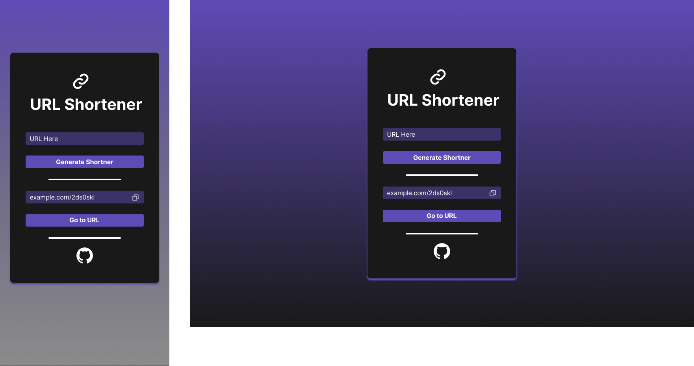

# url-shortener-web


This is a project that generate a shorten url.

## Design

For the design of this project, a Figma was initially created for UI/UX development.

The design can be found in the [Figma Design Project](https://www.figma.com/file/kOnCZqIuzuebYImVVdghxe/URL-Shortener?type=design&node-id=8%3A59&mode=design&t=kE8rWcGbbdf6Itb8-1).



## Technologies ⚙️

The main technologies for the front-end are:

* [Vue3JS](https://vuejs.org/)
* [Typescript](https://www.typescriptlang.org/)
* [Vite](https://vitejs.dev/guide/)

The main dependencies used are:

```json
"dependencies": {
    "vue": "^3.3.11"
},
"devDependencies": {
    "@rushstack/eslint-patch": "^1.3.3",
    "@tsconfig/node18": "^18.2.2",
    "@types/node": "^18.19.3",
    "@vitejs/plugin-vue": "^4.5.2",
    "@vitejs/plugin-vue-jsx": "^3.1.0",
    "@vue/eslint-config-prettier": "^8.0.0",
    "@vue/eslint-config-typescript": "^12.0.0",
    "@vue/tsconfig": "^0.5.0",
    "eslint": "^8.49.0",
    "eslint-plugin-vue": "^9.17.0",
    "npm-run-all2": "^6.1.1",
    "prettier": "^3.0.3",
    "sass": "^1.70.0",
    "typescript": "~5.3.0",
    "vite": "^5.0.10",
    "vue-tsc": "^1.8.25"
}
```

## Features

- [X] Send a request to API
- [X] Get result from API
- [X] Copy result
- [X] Open in new Tab

## Project Setup

```sh
npm install
```

### Compile and Hot-Reload for Development

```sh
npm run dev
```

### Type-Check, Compile and Minify for Production

```sh
npm run build
```

### Lint with [ESLint](https://eslint.org/)

```sh
npm run lint
```

## License

This project is open-source and is distributed under the MIT License. Feel free to explore, modify, and utilize the codebase according to the terms outlined in the license.

